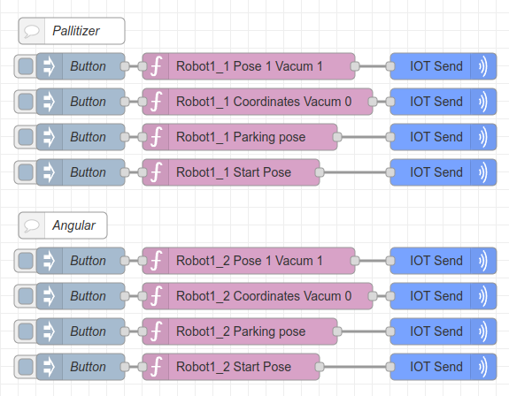
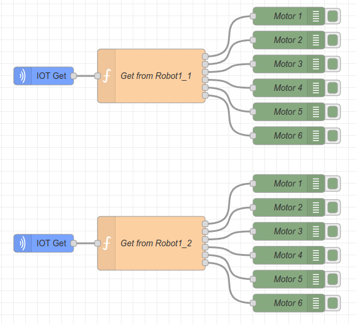
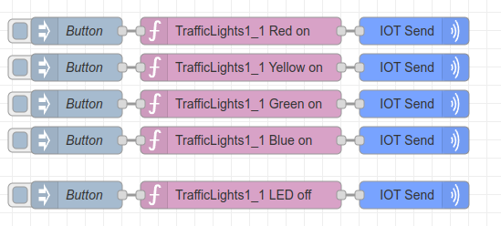
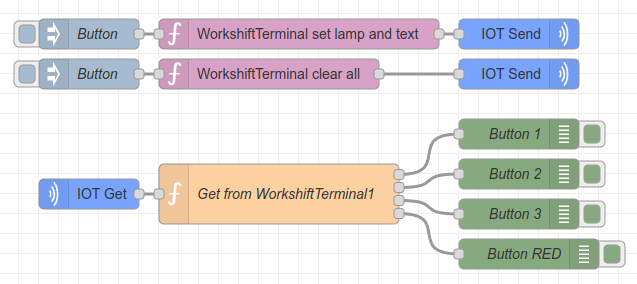
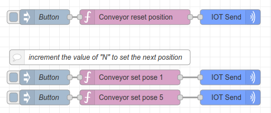
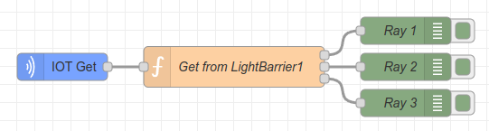
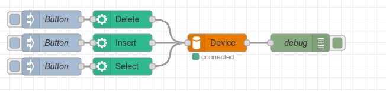

# node-red-contrib-iot-controlcenter

**Applied Robotics license**

## Example
+ Robot control\
\

---
+ TrafficLight control\

---
+ WorkshiftTerminal control\

---
+ Conveyor control\

---
+ LightBarrier control\

---
+ MySql\

---

## Install
Install via nodered pallete or run the following command in the root directory of your Node-RED install

```
npm install node-red-contrib-iot-controlcenter
```
